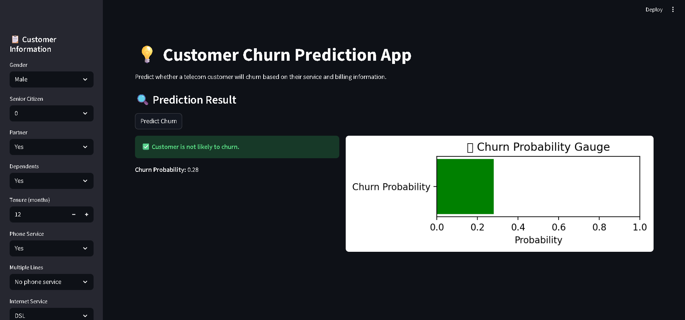

# 📊 Customer Churn Prediction Web App

This project is an end-to-end Machine Learning application that predicts whether a telecom customer is likely to churn.

---

## 🚀 Features
- Predict customer churn in real-time
- Interactive Streamlit web app
- Probability visualization for churn risk
- Fully automated ML pipeline

---

## 🧠 Tech Stack
- Python
- Pandas, NumPy
- Scikit-learn
- Streamlit
- Matplotlib

---

## 📈 Model Details
- Algorithm: Random Forest Classifier
- Hyperparameter tuning: RandomizedSearchCV
- Evaluation Metrics:
  - Accuracy: ~90%
  - ROC-AUC: High performance
  - Confusion Matrix & Classification Report

---

## ⚙️ Pipeline
- Data Cleaning
- Label Encoding (Binary Features)
- One-Hot Encoding (Categorical Features)
- Feature Scaling (StandardScaler)
- Model Prediction

---

## 🖥️ Run Locally

### 1. Clone the repository
```bash
git clone https://github.com/your-username/customer-churn-prediction-ml-app.git
cd customer-churn-prediction-ml-app


2. Install dependencies
pip install -r requirements.txt

3. Run the app
streamlit run app.py




